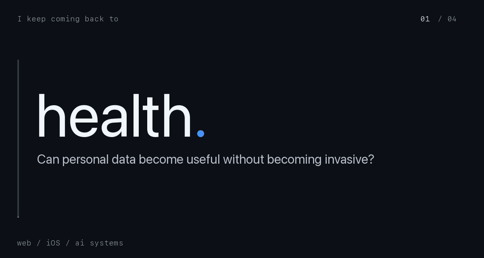

## I like improving my craft.

I don't have a perfectly tidy niche. I like projects that begin as a small personal problem and slowly turn into systems.

Most of my work is private.

I enjoy figuring out why things don't work the way they should. That led to my first substantial [open-source contribution](https://github.com/NousResearch/hermes-agent/pull/93828): investigating an authentication bug in Hermes Agent and being credited in the [final upstream fix](https://github.com/NousResearch/hermes-agent/pull/99520).

Mostly working with TypeScript, Next.js, SwiftUI, Convex, Python, and AI integrations.

[LinkedIn](https://www.linkedin.com/in/lates-robert-684169219/)
